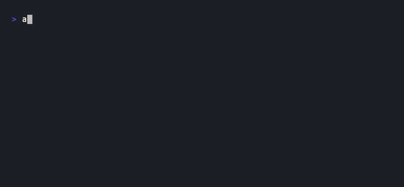

# 💾 AiGameSave (AGS)

**Zero-LLM context preservation tool for AI CLI Developers.**

AiGameSave (AGS) acts like a "save point" for your AI coding sessions. It extracts your current context (recent conversation history + modified files) and saves it as a lightweight YAML file. When you start a new session, you can "load" this save to bring your AI up to speed instantly—**without wasting massive amounts of tokens re-scanning the entire project.**

[](https://github.com/spondanai/aigamesave/actions/workflows/ci.yml)
[](https://go.dev/)
[](LICENSE)
[](CONTRIBUTING.md)



## ✨ Why AGS?

AI coding assistants are powerful, but starting a new session often means losing context—or spending dollars on input tokens just to re-read the workspace map. In agentic workflows this gets worse: the AI's own self-talk (running commands, checking logs, summarising results) can push your original instruction clean out of the context window.

AGS solves this by:
- **Zero Token Cost:** Uses 100% local Go logic (Git + file parsing). No API calls. Benchmarks show **~99% token reduction** vs raw session files ([see BENCHMARK.md](BENCHMARK.md)).
- **Instruction Anchoring:** Backward-searches for your last meaningful instruction so agentic self-talk can't evict it.
- **Smart Truncation:** Automatically truncates massive code blocks and terminal outputs from the history.
- **Noise-free Diff:** Lock files and generated assets (`go.sum`, `package-lock.json`, `yarn.lock`, etc.) are excluded from the diff automatically, so the token budget goes to real source changes.
- **Auto-Redaction:** Sanitises common API keys before saving to prevent accidental leaks.
- **Cross-platform:** Works on macOS, Linux, and Windows (including projects on non-home drives like `D:\`).
- **Plug-and-Play Architecture:** Incredibly easy to add support for new AI CLIs.

## 🚀 Supported AI CLIs

| Tool | Session location |
|---|---|
| **Aider** | `.aider.chat.history.md` |
| **Claude Code** | `~/.claude/projects/<encoded-dir>/*.jsonl` |
| **Gemini CLI** | `~/.gemini/tmp/<user>/chats/*.jsonl` (correlated by `projectHash`) |
| **Codex** | `~/.codex/sessions/**/*.jsonl` (correlated by session `cwd`) |
| **GitHub Copilot** (VS Code) | `workspaceStorage/<hash>/chatSessions/*.json` ¹ |
| **Cline** (VS Code) | `globalStorage/saoudrizwan.claude-dev/tasks/<ts>/api_conversation_history.json` ¹ |
| *Cursor* | ⏳ Coming soon — PRs welcome |

> ¹ Path resolves automatically for **macOS**, **Linux** (`$XDG_CONFIG_HOME`), and **Windows** (`%APPDATA%`).

---

## 📦 Installation

### Requires Go 1.22+

```bash
go install github.com/spondanai/aigamesave/cmd/ags@latest
```

AGS checks for newer versions in the background when you run `ags save` or `ags load`. If an update is available:

```bash
ags self-update
```

For offline or CI usage, set `AGS_SKIP_UPDATE_CHECK=1` to disable the check.

---

## 🎮 Usage

### 1. Save Your Game

Before ending your session (or when the AI seems to be losing context), run:

```bash
ags save
```

AGS will:
1. Auto-detect your active AI CLI (picks the one with the most recent session)
2. Extract conversation history using **Smart Anchor Search** (see below)
3. Run `git status` to find files currently being worked on
4. Redact any secrets found in the content
5. Save everything to `.aigamesave.yaml` (auto-added to `.gitignore`)

**Smart Anchor Search:** AGS backward-searches for your last meaningful instruction (≥10 characters) and uses it as an "anchor". It then keeps that anchor plus the most recent 5 turns after it. Short acknowledgements like "ok", "sure", or "ลองรันดู" are skipped so the anchor stays on your actual goal — not agentic self-talk.

**Override flags:**

```bash
# Force a specific adapter
ags save --adapter codex
ags save --adapter gemini
ags save --adapter claude
ags save --adapter copilot

# Skip embedding the git diff (saves tokens for large repos)
ags save --no-diff
```

Short aliases work too: `--adapter github` or `--adapter githubcopilot` both resolve to GitHub Copilot.

### 2. Load Your Game

When you return (or switch to a new AI session), run:

```bash
ags load
```

AGS reads `.aigamesave.yaml`, formats a concise resume prompt, and **copies it directly to your clipboard**. Paste it into your AI and say: *"Let's continue."*

The output includes:
- `## Recent context` — anchor turn + recent AI work
- `## Pending plan` — unfinished tasks automatically extracted from the AI's internal task manager (currently supports Claude Code's `TodoWrite`)
- `## Active files` — files mentioned in conversation (verified to exist on disk)
- `## Files being worked on` — git-status modified/untracked files
- `## Current diff` — `git diff HEAD` with lock files and generated assets excluded automatically; truncated to 3 000 bytes (unless `--no-diff` was used on save)

```bash
# Print to stdout instead of clipboard (useful for piping)
ags load --stdout
```

---

## 🛠️ How It Works

```
ags save
  │
  ├─ Detect Adapter ──── Scans for known AI history files; picks the one touched most recently
  ├─ Anchor & Extract ── Finds the last substantial user instruction + last 5 turns after it
  ├─ Noise Strip ──────── Removes repetitive blocks (e.g. Cline's <environment_details>)
  ├─ Plan Extraction ─── (Claude only) Extracts uncompleted tasks from internal tool calls
  ├─ File Context ─────── Regex-extracts file paths from conversation; verifies they exist on disk
  ├─ Git Vision ────────── git status --porcelain → ranks files by recency + mention count
  ├─ Diff Filter ──────── Excludes lock files & generated assets; truncates to 3 000 bytes
  ├─ Ignore Filter ─────── Applies .aigamesaveignore rules to GitVision + ActiveFiles
  ├─ Redact ────────────── Strips common secret patterns (API keys, tokens)
  └─ Save ──────────────── Writes .aigamesave.yaml

ags load
  │
  └─ Reads .aigamesave.yaml → formats resume prompt → clipboard (or stdout)
```

---

## 🚫 Token Optimization — `.aigamesaveignore`

Create a `.aigamesaveignore` file in your project root to exclude files from the saved context. This keeps token usage low when your project has large generated files, vendor directories, or lockfiles.

**Syntax** (subset of `.gitignore`):

```gitignore
# Exclude a directory and everything inside it
vendor/
node_modules/

# Exclude by file extension (matches anywhere in the tree)
*.pb.go
*.gen.go
go.sum

# Exclude an exact path or glob
internal/generated/*.go
dist/**
```

Copy [`.aigamesaveignore.example`](.aigamesaveignore.example) from the repo as a starting point.

Unlike `.gitignore`, this file is **project-specific configuration** — you should commit it so the whole team shares the same context budget.

---

## 🤝 Contributing

See [CONTRIBUTING.md](CONTRIBUTING.md) for the full guide. The short version:

1. Create `internal/adapters/<name>_adapter.go` and implement `HistoryExtractor`.
2. Add your adapter to `registry.go` (one line).
3. Call `selectContext(turns)` — never slice turns manually.
4. Open a PR. 🎉

### Good First Issues
Check the [Issues tab](https://github.com/spondanai/aigamesave/issues). We are actively looking for an adapter for **Cursor**.

---

## 📜 License

MIT License. See [LICENSE](LICENSE) for more information.
